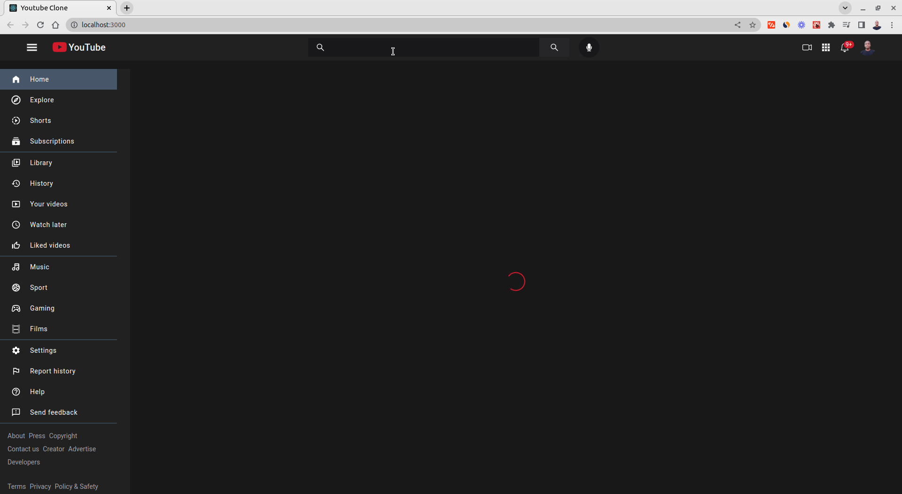

# YouTube Clone

[](https://react-youtube-clone-ts.netlify.app/)

## Technologies

- React
- TypeScript
- Redux
- Redux Toolkit
- TailwindCSS
- YouTube API

## Setup

```code
# Clone this repo
git clone https://github.com/hesbon-osoro/youtube-clone.git

# Navigate to directory and install packages
cd youtube-clone && yarn

# Start the App
yarn start
```

Copy `.env.example` to `.env` and use your required credentials

[](https://www.buymeacoffee.com/wazimu)
